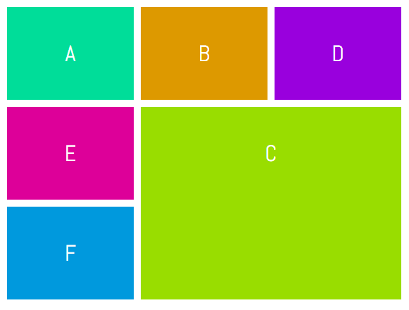
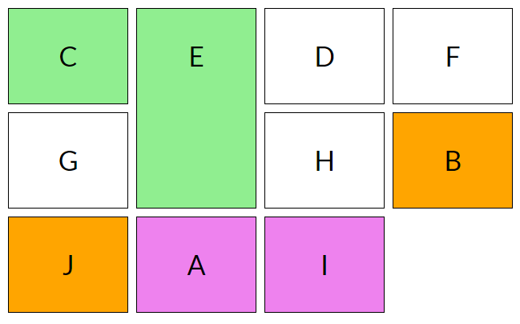
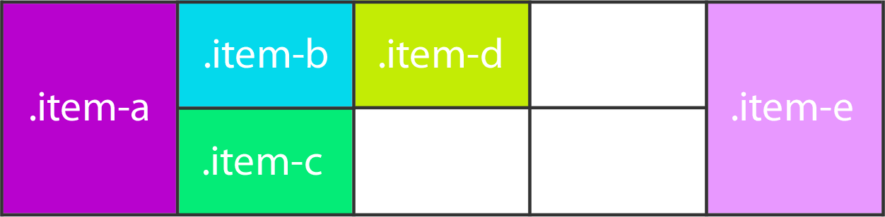

# Изучить материал

* https://developer.mozilla.org/ru/docs/Web/CSS/overflow
* https://css-tricks.com/almanac/properties/o/overflow/
* https://css-tricks.com/examples/OverflowExample/

* https://learn.javascript.ru/float
* https://developer.mozilla.org/ru/docs/Web/CSS/float

* https://learn.javascript.ru/position
* https://developer.mozilla.org/ru/docs/Web/CSS/position
* https://medium.com/web-standards/sticky-bc7ff7088693

# Практика

1) Сверстать макеты
* 
* 

2) Сверстать макет
* 