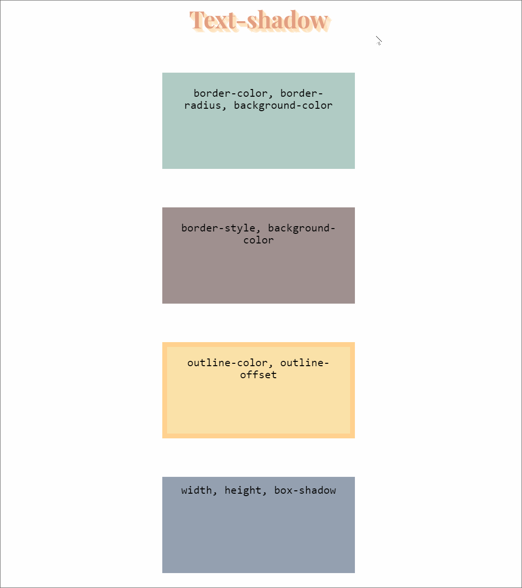

# Изучить материал

* https://developer.mozilla.org/ru/docs/Web/CSS/transition
* https://developer.mozilla.org/ru/docs/Web/CSS/CSS_Transitions/Using_CSS_transitions
* http://htmlbook.ru/css/transition-timing-function

* https://developer.mozilla.org/en-US/docs/Web/CSS/CSS_animated_properties

* https://developer.mozilla.org/ru/docs/Web/CSS/transform

# Практика

1) Сверстать и создать анимацию для обьектов. Длительность анимации везде 1s. Задержка анимации везде 0.25s. Все цвета и отступы могут быть изменены. Свойства которые задействованы в анимации указаны в контенте элементов.

