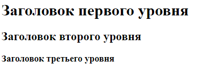
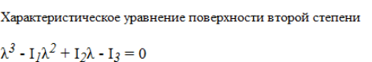

# Изучить материал

* http://htmlbook.ru/samhtml/znacheniya-atributov-tegov/tsvet
* http://htmlbook.ru/samhtml/znacheniya-atributov-tegov/razmer
* http://htmlbook.ru/samhtml/tekst
* http://htmlbook.ru/samhtml/tipy-tegov/blochnye-elementy
* http://htmlbook.ru/samhtml/tipy-tegov/strochnye-elementy
* http://ibrain.kz/sozdanie-web-saytov/parnye-i-odinochnye-tegi-konteynery

# Практика

1. Практика(тренируемся в использовании тегов и атрибутов):
 * Сверстать заголовки: 
 * 
 * Сверстать формулу:   
 * 
 * Подсказка: http://htmlbook.ru/samhtml/tekst/verkhniy-i-nizhniy-indeks
 * Сверстать макет: 

