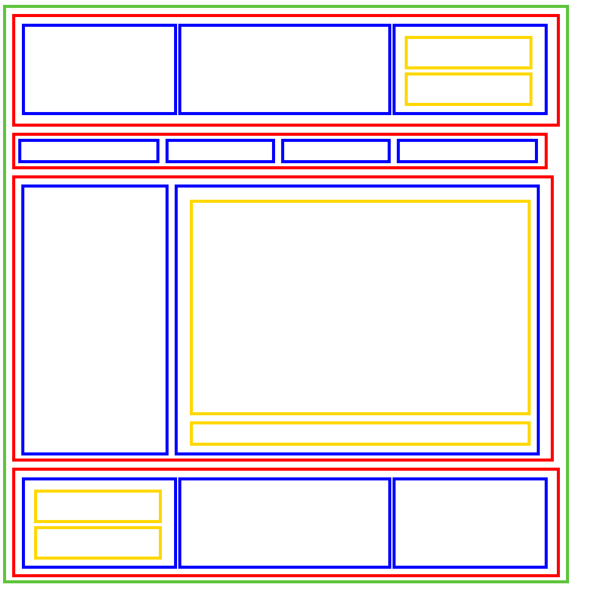

# Изучить материал

* https://html5book.ru/block-inline-elements/#part7
* https://learn.javascript.ru/margin
* https://learn.javascript.ru/height-percent
* https://ru.learnlayout.com/margin-auto.html

# Практика

1) Верстаем 
